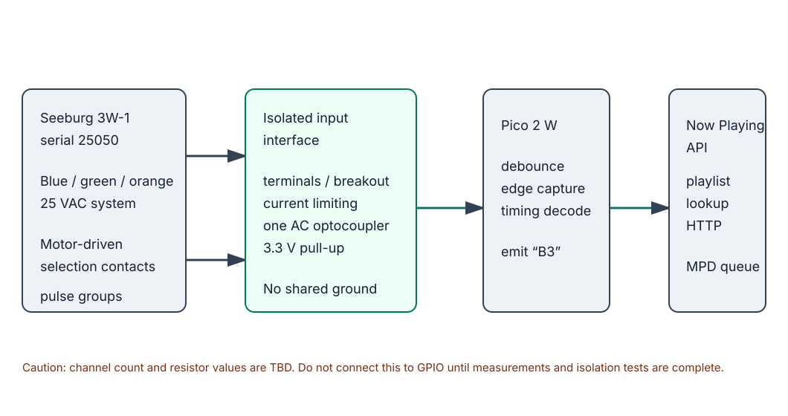

# Seeburg Wallbox Project

This wiki documents the investigation and implementation of a physical Seeburg Wallbox input for the Now Playing music system.

The supplied source manual is [`3w1.pdf`](/Users/brianwis/Public/3w1.pdf), a 33-page Seeburg service manual for the Wall-O-Matic Type 3W-1.

## Project goal

Allow a person to make a selection on the Wallbox—eventually represented as a code such as `B3`—and have the corresponding song appended to the Now Playing cue.

## Current architectural model

1. The Wallbox mechanism changes electrical contacts.
2. An isolated input stage observes those contacts.
3. A small real-time controller debounces and decodes the contact sequence.
4. The Pico converts the validated selection to a playlist position from 1 through 100.
5. The Pico submits that number directly to the Now Playing app-host API.
6. Now Playing clears and starts the selected track when stopped or paused, and appends it without interruption when playback is active.

## Pages

- [Architecture](architecture.md)
- [Hardware reverse engineering](hardware-reverse-engineering.md)
- [Software integration](software-integration.md)
- [Build log](build-log.md)
- [Parts list](parts-list.md)
- [Interface schematic](interface-schematic.svg)
- [Components and wiring graphic](components-wiring.svg)
- [Step-by-step wiring procedure](wiring-build-procedure.md)
- [Data Sync Wallbox to iPod adaptation](datasync-adaptation.md)
- [Isolated input stage](isolated-input-stage.md)
- [As-built wiring record](as-built-wiring.md)

The diagrams are included as standalone SVG images so GitHub can render them
directly:

## Confirmed from the 3W-1 manual

- The Wall-O-Matic operates at 25 VAC, 60 Hz, over a three-wire cable.
- The blue and green conductors power the Wall-O-Matic; orange is the ground/common side of the selection circuit.
- A selection is made by pressing one letter button and one number button.
- The motor rotates a grounded contact arm across the selector plate. The resulting selection is sent as two pulse trains to the Selection Receiver, not as a literal digital `B3` value.
- The first pulse train contains 2–21 pulses and encodes the number plus the first/second letter of a pair; the second contains 1–5 pulses and identifies the letter pair (`A/B`, `C/D`, `E/F`, `G/H`, or `J/K`).
- Pulses are approximately 1/25 second apart, with approximately 1/5 second between pulse groups.
- The motor is specified at 24 RPM, with 21–26 RPM acceptable. A slow motor can produce incorrect pulse timing.
- Schematics differ by serial range: below 2303, 2303–16646, and above 16645. The unit’s serial number must be recorded before designing an interface.
- The project’s Wallbox is stamped serial 25050, placing it in the later, above-16645 variant; see [`wallbox-serial.jpg`](/Users/brianwis/Public/wallbox-serial.jpg).

These findings come from manual pages 2–11, especially Figures 2, 15, 16, and 17.

## Confirmed as-built interface

The working installation is documented in [As-built wiring](as-built-wiring.md).
It uses the Wallbox `SIGNAL`/`COMMON` pair into the two DB107 `~` terminals,
an external 10 kΩ, 1/2-watt resistor from DB107 `+` to the optocoupler module's
`INPUT+`, and the module's isolated `VCC`/`OUT`/`GND` terminals to Pico 3V3,
GP15, and GND. Seeburg COMMON and Pico GND are not connected. The observed
rectified-AC timing is decoded in software rather than smoothed in hardware.

## Evidence rule

Claims about the Wallbox electrical behavior remain provisional until supported by the exact model documentation, photographs, continuity measurements, or captured contact traces. Do not treat a generic Seeburg schematic as proof for a different model.

## Relationship to Now Playing

Now Playing remains the playback and queue system. This project is an input adapter and resolver. Its integration target is the app-host control plane, not a second independent MPD controller.

The live integration endpoint is `POST /integrations/seeburg/selection` on the local
Now Playing host at `10.0.0.4:3101`. It uses the saved `Seeburg Playlist` order as
the catalog. When audio is stopped or paused, it clears the live queue, adds the
selected track, and starts playback; while audio is already playing, it appends
the selected track without interrupting playback. The Pico 2W firmware is in
LIVE mode and is reachable at `10.0.0.118`.

Last updated: 2026-08-29 America/Chicago
